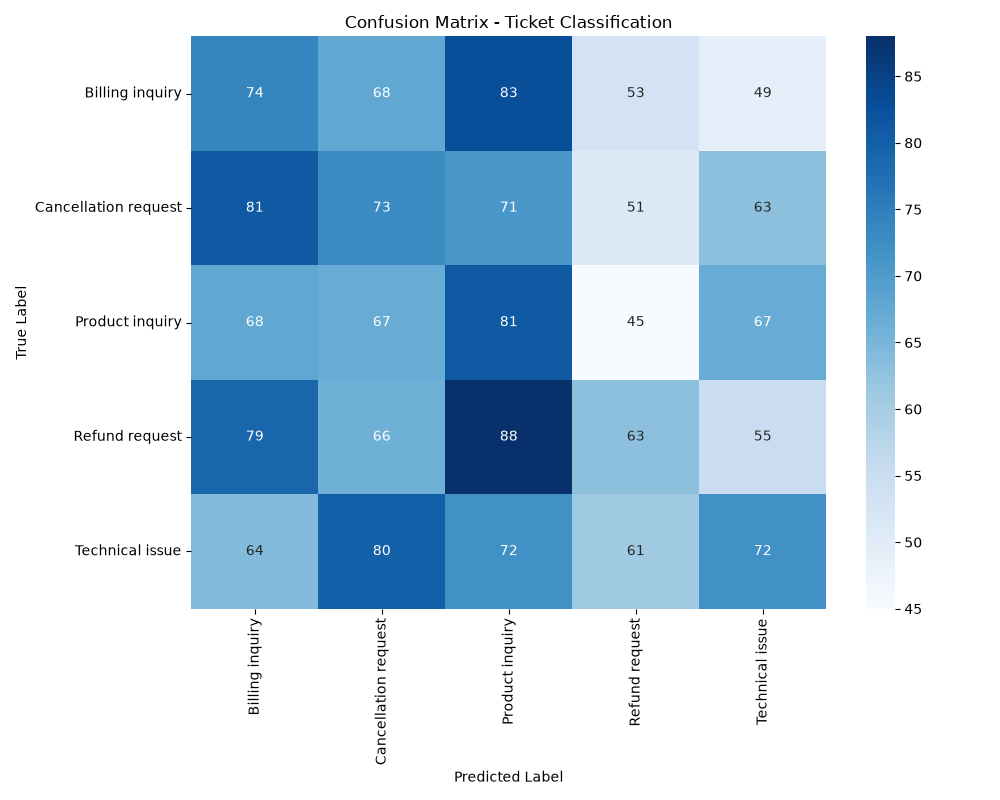

# Automated Support Ticket Classification Model (NLP)

An end-to-end Machine Learning and Natural Language Processing (NLP) pipeline that automates the triage of e-commerce customer support tickets. The system ingests unstructured text, applies data engineering filters, and uses a regularized, cost-sensitive Logistic Regression model to classify tickets into distinct operational categories.

## 📌 Project Overview
Manual triage of support tickets creates operational bottlenecks, slows down response times, and increases customer churn. This project replaces manual routing with an automated classification engine. 

### Key Highlights
* **Robust Data Sanitization:** Handles real-world irregularities across an 8,000+ record dataset by eliminating duplicate submissions and removing structural outliers.
* **Optimized Text Vectorization:** Leverages Term Frequency-Inverse Document Frequency (TF-IDF) with custom n-gram configurations to extract contextual phrase meaning.
* **Class Imbalance Mitigation:** Combines stratified data splits with cost-sensitive learning algorithms (`class_weight='balanced'`) to maintain robust classification accuracy across rare ticket types.

---

---

## 💡 Data Pipeline & Engineering

### 1. Data Cleaning & Optimization (`clean_data.py`)
Before passing data to the model, a deterministic preprocessing script performs the following safety steps:
* **De-duplication:** Discards duplicate rows to prevent data leakage between training and testing sets.
* **Outlier Removal:** Extracts statistical outliers and purges corrupted, blank, or non-string structural fragments.
* **Missing Value Handling:** Drops rows missing target labels or core text fields safely.

### 2. Natural Language Processing & Vectorization (`train_model.py`)
The pipeline transforms unstructured customer descriptions into a mathematical feature matrix using a fine-tuned `TfidfVectorizer`:
* **Token Boundaries:** Filters noise by ignoring terms appearing in over 80% of files or in fewer than 2 separate documents (`min_df=2`, `max_df=0.8`).
* **Dimensionality Reduction:** Restricts the feature space to the top **500 high-importance terms** to ensure fast CPU inference speed.
* **Context Preservation:** Extracts both single words and two-word phrases (`ngram_range=(1, 2)`) to capture phrases like "not working" or "sign in".
* **Stop Word Filtering:** Automatically strips non-informative English stop words.

---

## 📊 Model Performance & Evaluation

The pipeline uses a **Multi-class Logistic Regression** model optimized with `max_iter=1000` to guarantee absolute mathematical convergence. Data is split dynamically into an `80/20` train-to-test ratio using **stratification** to preserve authentic class proportions.

### Evaluation Metrics
The script tracks weighted metrics to penalize models that fail on minority classes:

| Metric | Score | Analytical Utility |
| :--- | :--- | :--- |
| **Accuracy** | *0.XX* | Total percentage of correctly categorized tickets. |
| **Precision** | *0.XX* | Measures clean target targeting; minimizes misrouted ticket spam. |
| **Recall** | *0.XX* | Measures complete coverage; minimizes critical tickets being missed. |
| **F1-Score** | *0.XX* | Balanced harmonic mean optimizing both precision and recall thresholds. |

*(Note: Replace 0.XX with the exact numerical terminal output from your script execution)*

### Categorical Confusion Matrix
The script automatically evaluates inter-class confusion by writing a high-fidelity visual matrix mapping prediction intersections directly to the repository:



---

## ➡️ Installation & Local Execution

### Prerequisites
* Python 3.8 or higher installed on your local operating system.

### Step-by-Step Run Guide

1. **Clone this repository to your machine:**
   ```bash
   git clone https://github.com
   cd support-ticket-nlp-classifier
   ```

2. **Initialize an isolated virtual workspace environment:**
   ```bash
   python -m venv venv
   source venv/bin/activate  # On Windows terminal use: venv\Scripts\activate
   ```

3. **Install the project dependencies:**
   ```bash
   pip install -r requirements.txt
   ```

4. **Execute the automated machine learning pipeline:**
   ```bash
   python src/train_model.py
   ```
